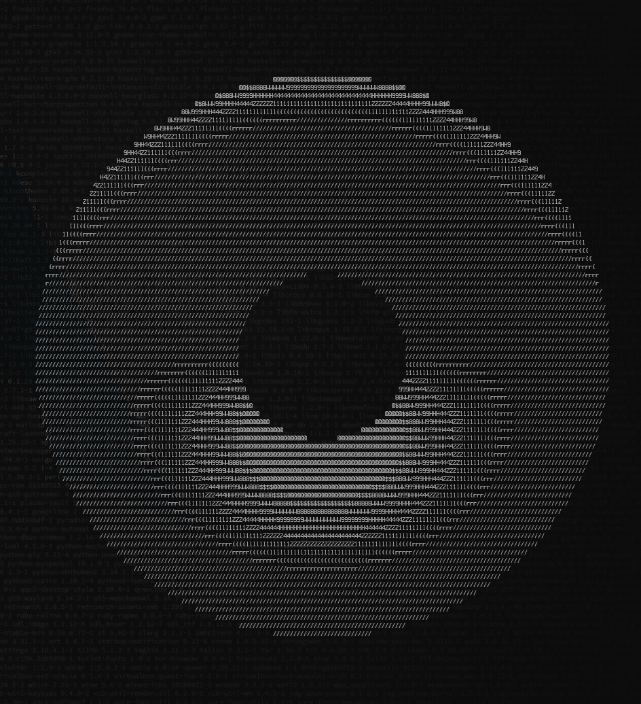
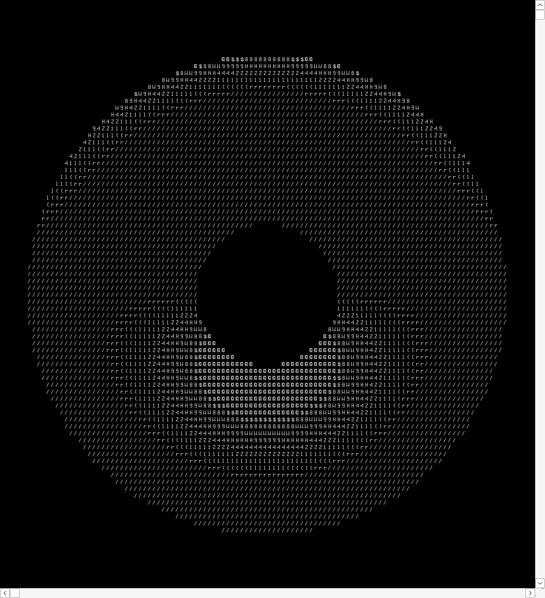

<br />
<div align="center">
  <h2 align="center">The Raymarhing engine written in C with rendering from console.</h2>
  <a href="https://github.com/timeless812/console-raymarching">
    
    
  </a>
  <p align="center">
    Works simply from the console using <a href="https://en.wikipedia.org/wiki/Ncurses">ncurses</a>.
  </p>
</div>

## Overview

This engine can only take the object's SDF function (write it to src/cpu_engine.c or kernel.cl,
depending on whether you want to run on CPU or GPU) and render it using raymarching.
In my engine, there is only light calculation, no shadows or reflections.

The camera is controlled from the keyboard (implemented via getch() in ncurses).
In the previous version, there was control over the rotation of the camera with the mouse,
which I implemented by reading events in /dev/input/mice, but this kind of requires sudo, so I removed that.

## Camera Control

W, A, S, D - movement, <br>
I, J, K, L - rotate.

Also you may change the speed and sensitivity in src/camera.c.

## CPU and GPU engine

In this project, there are two raymarching engines: one for CPU (src/cpu_engine.c), the other for GPU (kernel.cl).
For the GPU engine, you will need the OpenCL library on the system.

## How to Build
The project is built through the Makefile. I didn't test on Windows, so I just used a cross compiler.

The build requires the ncurses library. If you want try rendering through the GPU, you can install OpenCL library.

## Installing OpenCL (Optional)

I have intel UHD graphics and I installed OpenCL like this

```sh
sudo pacman -S opencl-headers intel-compute-runtime ocl-icd
```

To verify that OpenCL works, you can check via clinfo
```
sudo pacman -S clinfo
clinfo
```

## Build

```sh
make all
# or
make clean compile
```

For rendering via GPU add the OPENCL=1
```
make all OPENCL=1
```

You can start it manually
```
./build/raymarching
```

I'll note that main.c has a color mode flag.
The color mode displays colored spaces instead of symbols. This may not work on some terminals and on Windows.

## To do List

* Bring back the control of the camera rotation with the mouse.
* Add loading the SDF function (or scene) directly from main.c.
* Add shadows and reflections.
* Add a more interesting scene to test.
